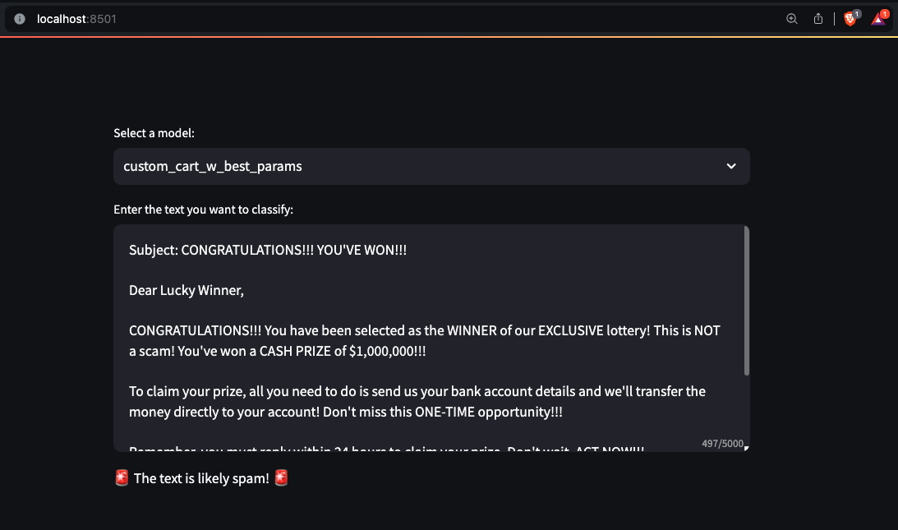

# Email Spam Classifier Project

## Overview

This project presents a robust machine learning framework for spam detection, featuring a variety of algorithms implemented from scratch, including Decision Trees, Ensemble Methods (Random Forest, Gradient Boosting, and XGBoost), Logistic Regression, Naive Bayes, Support Vector Machines (SVM), and unsupervised clustering techniques. Each custom implementation is thoroughly experimented with and benchmarked against its scikit-learn counterpart using the UCI Spambase dataset. The project includes a custom-built experimentation framework, automated CI/CD pipelines for consistent testing and deployment, and a user-friendly interface for real-time predictions.

## Project Structure
- `.github/workflows`: Contains CI/CD pipelines for automated testing, training, and deploying models.
- `experiments`: Configuration files for running a variety of experiments, their corresponding results and also serialized models.
- `models`: Serialized models from both custom implementations and scikit-learn models.
- `notebooks`: Jupyter notebooks for EDA, model development, model training and evaluation.
- `reports`: Generated reports comparing the performance of different models.
- `src`: Source code for different modules including `data`, `experiments`, `models`, `features`, `evaluation` and `visualization`.
- `tests`: Unit and integration tests to ensure the reliability of the system.
- `Dockerfile`: Configuration for containerizing the application.
- `app.py`: The UI application for real-time predictions.
- `experiment_runner.py`: The main script for running the experimentation framework.
- `requirements.txt`: Required Python packages for the project.
- `run_config.json`: Specifies which experiment configuration to run from the experiments folder.
- `setup.py`: Setup utilities for the project.

